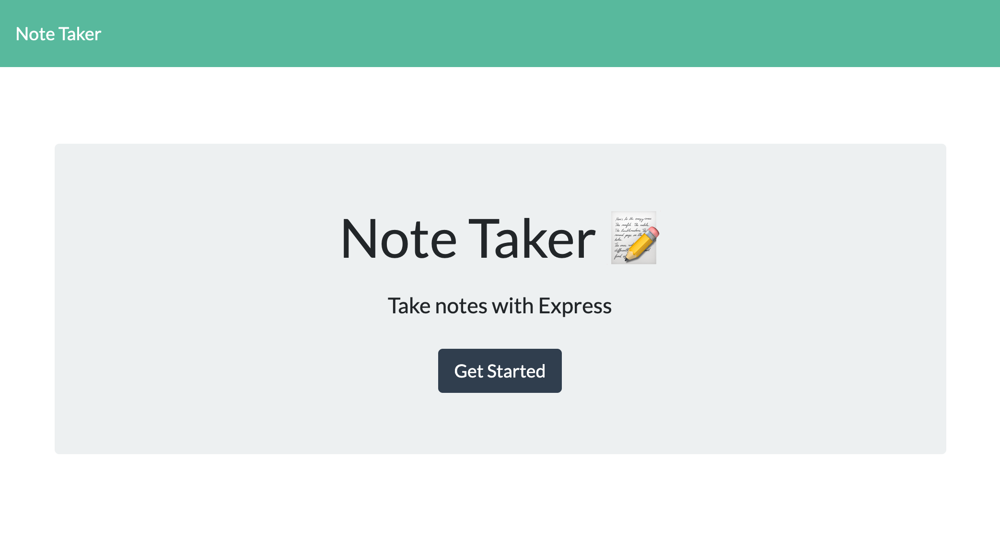
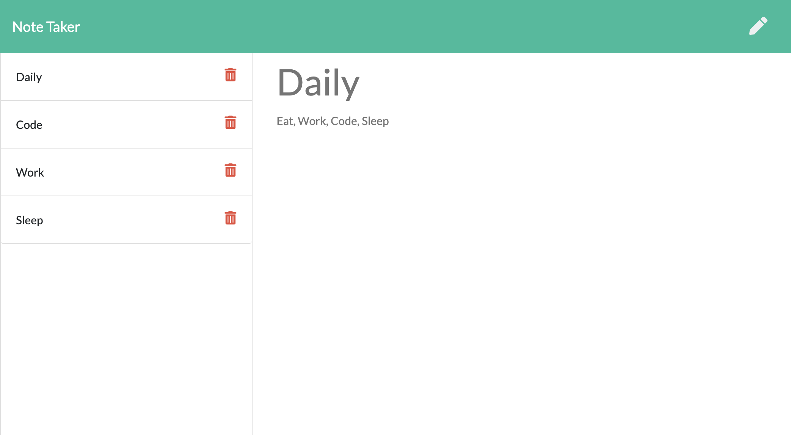
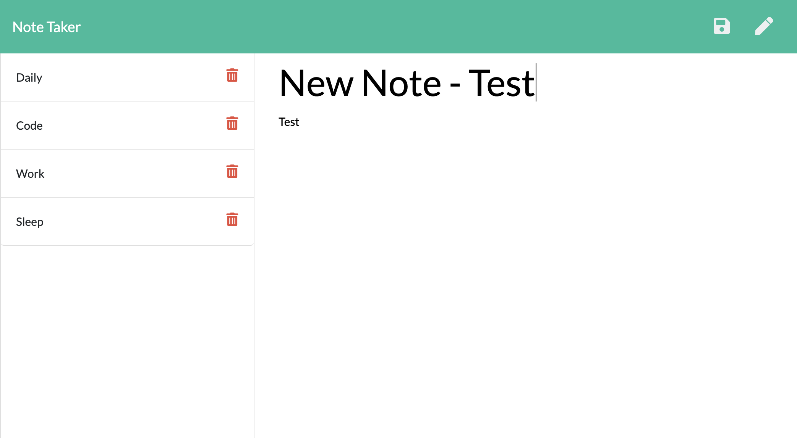

# Note Taker

Create an application called Note Taker that can be used to write, save and delete notes. This application will use an Express.js back end and will save and retrieve note data from a JSON file.

## Live APP

https://frozen-lake-17778.herokuapp.com/

## Mock Up

## Installation

1. Clone this repo or download zip
2. install npm: npm install
3. run the app: node start
